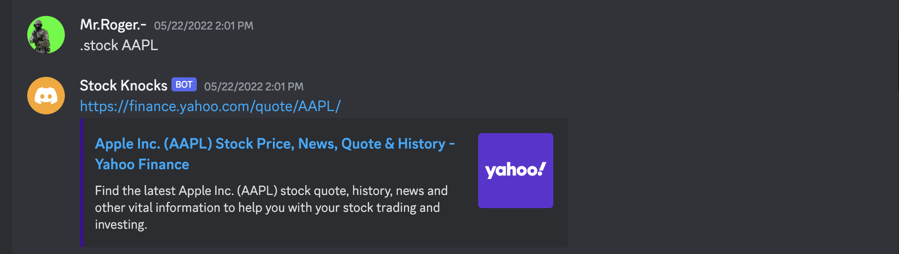
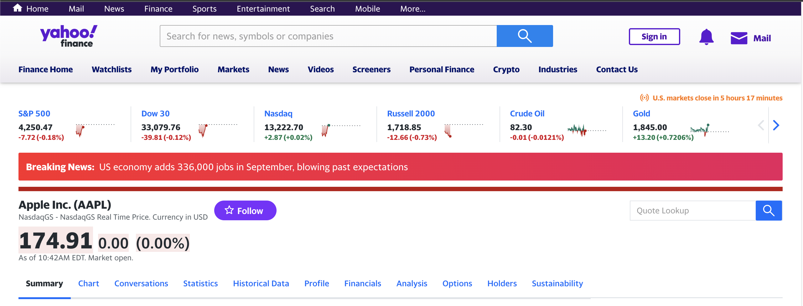

# Discord-Stock-Bot

## About
This Discord bot provide's information on real time stock prices. With command,

```
.stock {Stock Name}
```

The bot will provide a link to a,

```
finance.yahoo.com
```

webpage. The bot will run indefinitely until the application is terminated.

## Functionality
### Stock Call

Call the function,

```
.stock
```
along with the name of the stock, and the bot will a link to webpage.

### 



Once the link has been provided and the link has been clicked, the contents of the webpage will open on the users default web browser.



### Talk Functionality
In case the user would like to talk the to Discord Bot, the command,

```
.iwannatalk
```

The Bot will reply with the response,

```
you do not need me go talk to someone else, stupid.
```

